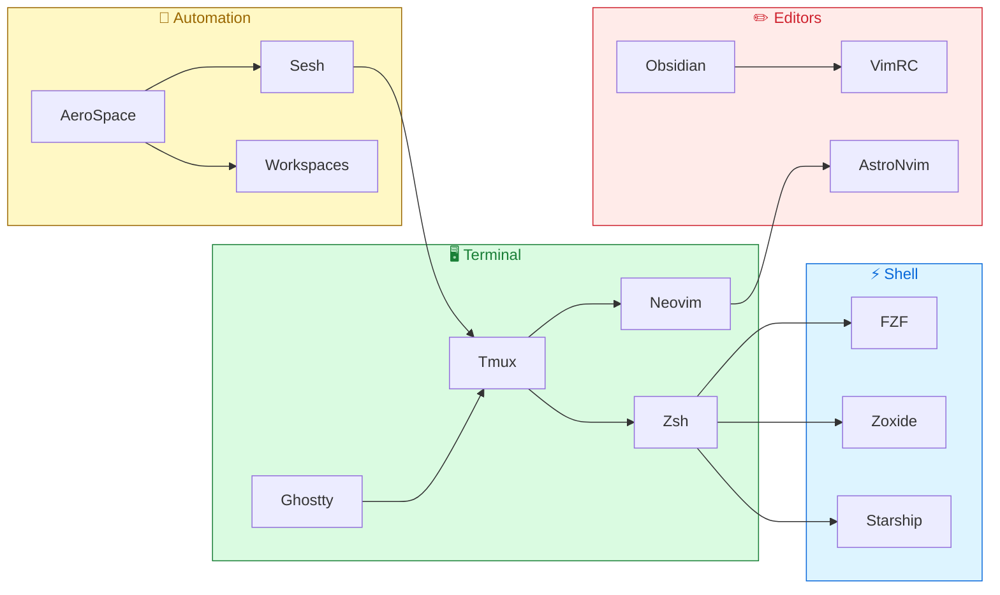

# dotfiles


Personal macOS development environment. Vim keybindings everywhere, GitHub-themed light/dark, one-command bootstrap.

<p align="center">
  
</p>

## Quick Setup

```bash
git clone https://github.com/snesjhon/dotfiles.git ~/Developer/dotfiles
cd ~/Developer/dotfiles/os
./install.sh
```

The install script handles everything: Homebrew, packages, symlinks, tmux plugins, Claude Code skills, and npm globals.

## What's Inside

```
dotfiles/
├── nvim/          AstroNvim v5 config with 20+ plugins
├── tmux/          Terminal multiplexer, session management + scripts
├── zsh/           Shell config, vim mode, custom functions
├── ghostty/       Terminal emulator (GitHub theme, ligatures)
├── aerospace/     Tiling window manager + app/session hotkeys
├── starship/      Minimal cross-shell prompt
├── obsidian/      Vim keybindings for Obsidian
├── claude/        Custom Claude Code skills (LeetCode prep)
├── formatters/    Prettier config
└── os/            Bootstrap scripts & Brewfile
```

## Architecture



## Highlights

### Neovim

AstroNvim v5 framework with Lazy.nvim. Key plugins:

| Category   | Plugin              | Purpose                              |
| ---------- | ------------------- | ------------------------------------ |
| Theme      | `github-nvim-theme` | Light/dark follows system appearance |
| Completion | `blink.cmp`         | Fast, cursor-based completion        |
| Navigation | `flash.nvim`        | Jump anywhere with `s`               |
| Markdown   | `markview.nvim`     | In-editor markdown preview           |
| Git        | `diffview.nvim`     | Side-by-side diffs                   |
| Focus      | `no-neck-pain.nvim` | Centered editing (119 cols)          |
| Fun        | `leetcode.nvim`     | Solve problems in-editor             |

### Tmux

- **Prefix:** `C-a`
- **Smart pane nav:** `C-h`/`C-l` detect vim and pass-through
- **Session management:** Sesh + FZF with GitHub-themed picker (`prefix+d`)
- **File browser:** Yazi toggle (`prefix+e`)
- **Theme:** Tokyo Night Storm via tmux-powerkit

### AeroSpace

Window management uses `alt` (Option), app launching and session switching use **Meh** (`Shift+Ctrl+Alt`):

**Window management**

| Key                  | Action                        |
| -------------------- | ----------------------------- |
| `alt-h/j/k/l`        | Focus window                  |
| `alt-ctrl-h/j/k/l`   | Move window                   |
| `alt-y/u/i/o/p`      | Switch workspace 1–5          |
| `alt-ctrl-y/u/i/o/p` | Send window to workspace 1–5  |
| `alt-r` → `h/j/k/l`  | Resize mode                   |
| `alt-f`              | Fullscreen                    |
| `alt-shift-f`        | Toggle float                  |
| `alt-slash`          | Toggle split direction        |
| `alt-tab`            | Back-and-forth workspace      |

**App workspaces (Meh)**

| Key     | Action                              |
| ------- | ----------------------------------- |
| `Meh+F` | Workspace 1 — Ghostty               |
| `Meh+D` | Workspace 2 — Chrome                |
| `Meh+S` | Workspace 3 — Obsidian              |
| `Meh+A` | Workspace 4 — Music                 |
| `Meh+E` | Tmux: leetcode session              |
| `Meh+W` | Tmux: dotfiles session              |
| `Meh+R` | Tmux: snesjhon session              |

### Zsh

- Vim keybindings (`bindkey -v`)
- Starship prompt + Zoxide for fast navigation
- FZF integration with GitHub light theme
- Auto-sourced functions from `zsh/functions/`

## Symlink Map

```
nvim/                    → ~/.config/nvim/
tmux/tmux.conf           → ~/.tmux.conf
zsh/zshrc                → ~/.zshrc
zsh/zprofile             → ~/.zprofile
starship/starship.toml   → ~/.config/starship.toml
ghostty/config.toml      → ~/.config/ghostty/config
aerospace/aerospace.toml → ~/.aerospace.toml
obsidian/obsidian.vimrc  → ~/Developer/snesjhon/.obsidian.vimrc
```

## Brewfile Snapshot

<details>
<summary>CLI Tools</summary>

`neovim` `tmux` `fzf` `ripgrep` `tree-sitter` `gh` `node` `nvm` `python3` `zoxide` `starship` `zsh-autocomplete` `zsh-autosuggestions` `zsh-syntax-highlighting`

</details>

<details>
<summary>GUI Apps</summary>

`aerospace` `ghostty` `google-chrome` `monitorcontrol` `obsidian`

</details>
