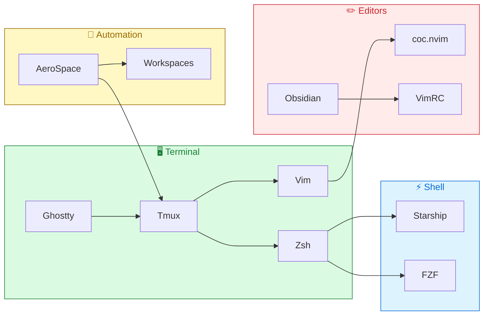

# dotfiles


Personal macOS development environment. Vim keybindings everywhere, GitLab-themed light/dark, one-command bootstrap.

<p align="center">
  
</p>

## Quick Setup

```bash
git clone https://github.com/snesjhon/dotfiles.git ~/Developer/dotfiles
cd ~/Developer/dotfiles/os
./install.sh
```

The install script handles everything: Homebrew, packages, symlinks, tmux plugins, and npm globals.

## What's Inside

```
dotfiles/
├── vim/           Vanilla Vim config (coc.nvim LSP, fzf, GitLab theme)
├── tmux/          Terminal multiplexer, session management + scripts
├── zsh/           Shell config, vim mode, custom functions
├── ghostty/       Terminal emulator (GitLab theme, ligatures)
├── aerospace/     Tiling window manager + app/session hotkeys
├── starship/      Minimal cross-shell prompt
├── obsidian/      Vim keybindings for Obsidian
├── yazi/          Terminal file manager (GitLab themed)
├── ripgrep/       Shared rg ignore rules ($RIPGREP_CONFIG_PATH)
├── scripts/       Standalone helper scripts (fzf preview, dev runner, etc.)
└── os/            Bootstrap scripts & Brewfile
```

## Architecture


```mermaid
graph LR
    subgraph Terminal["🖥 Terminal"]
        Ghostty --> Tmux
        Tmux --> Zsh
        Tmux --> Vim
    end

    subgraph Shell["⚡ Shell"]
        Zsh --> Starship
        Zsh --> FZF
    end

    subgraph Automation["🔧 Automation"]
        AeroSpace --> Workspaces
        AeroSpace --> Tmux
    end

    subgraph Editors["✏️ Editors"]
        Vim --> CocNvim["coc.nvim"]
        Obsidian --> VimRC
    end

    style Terminal fill:#dafbe1,stroke:#1a7f37,color:#1a7f37
    style Shell fill:#ddf4ff,stroke:#0969da,color:#0969da
    style Automation fill:#fff8c5,stroke:#9a6700,color:#9a6700
    style Editors fill:#ffebe9,stroke:#cf222e,color:#cf222e
```

## Highlights

### Vim

Vanilla Vim (`vim/vimrc` + `vim/plugins.vim` via vim-plug), one file per plugin under `vim/plugins/`. Key plugins:

| Category       | Plugin                       | Purpose                                             |
| -------------- | ----------------------------- | ----------------------------------------------------- |
| LSP/Completion | `coc.nvim`                    | LSP, completion, diagnostics (JS/TS/React/JSON)        |
| Theme          | `gitlab-vim-theme`            | Light/dark, matches bat/yazi themes                    |
| Statusline     | `lightline.vim`               | Statusline + buffer tabs                               |
| Fuzzy find     | `fzf.vim` + `coc-fzf`         | File/grep/CoC-list search                              |
| Recent files   | `mru.vim` (custom)            | Tracks file history for the terminal `fr` picker       |
| Pane nav       | `smart-splits.vim` (custom)   | Seamless vim ⇄ tmux pane navigation (`C-h`/`C-l`)      |
| Motion         | `vim-easymotion`              | Jump anywhere                                          |
| Git            | `vim-fugitive`                | Git integration, PR review diffs                       |
| Auto-pairs     | `auto-pairs`                  | Bracket/quote auto-closing                             |
| File browser   | `yazi.vim` (custom)           | Yazi chooser via `<F6>`                                |
| Focus          | `no-neck-pain.vim`            | Centered editing                                       |
| Start screen   | `vim-startify`                | Dashboard on a bare `vim` launch                       |

### Tmux

- **Prefix:** `C-a`
- **Smart pane nav:** `C-h`/`C-l` detect vim and pass-through
- **Session switcher:** `tmux-session.sh`, fzf-driven (bound to AeroSpace `Meh+B`, see below)
- **Zen mode:** `prefix+g` toggles a centered pane via `tmux-zen.sh` — manual, per window, never automatic
- **File browser:** Yazi — `C-S-y` toggles, `prefix+E` opens in a new window
- **Theme:** Tokyo Night Storm via tmux-powerkit

### AeroSpace

Window management uses `alt` (Option); app launching and session switching use **Meh** (`Shift+Ctrl+Alt`):

**Window management**

| Key                        | Action                       |
| --------------------------- | ---------------------------- |
| `alt-h/j/k/l`               | Focus window                 |
| `alt-ctrl-h/j/k/l`          | Move window                  |
| `alt-1`…`alt-5`             | Switch to workspace 1–5      |
| `alt-a/s/d/f/g`             | Send window to workspace 1–5 |
| `alt-r` → `h/j/k/l`         | Resize mode                  |
| `alt-slash`                 | Toggle split direction       |
| `alt-comma`                 | Accordion (stack) layout     |
| `alt-period`                | Toggle float                 |
| `alt-m`                     | Back-and-forth workspace     |
| `alt-shift-tab`             | Focus next monitor           |
| `alt-shift-r`               | Reset workspaces             |
| `alt-shift-slash`           | Service mode (reset layout, close all but current) |

**App workspaces (Meh) & sessions**

| Key                | Action                                    |
| ------------------- | ------------------------------------------ |
| `Meh+A`             | Workspace 1 — Slack                       |
| `Meh+S`             | Workspace 2 — Obsidian                    |
| `Meh+D`             | Workspace 3 — Chrome                      |
| `Meh+F`             | Workspace 4 — Ghostty                     |
| `Meh+G`             | Workspace 5 — Ignition                    |
| `Meh+B`             | Tmux: dev session (`tmux-session.sh`)     |

Windows also auto-assign to workspaces on launch (Slack→1, Obsidian→2, Chrome→3, Ghostty→4, Ignition Designer→5) regardless of how they were opened.

### Zsh

- Vim keybindings (`bindkey -v`)
- Starship prompt; FZF colors auto-follow macOS light/dark, synced with vim/bat/yazi's GitLab theme
- Custom fzf pickers (`zsh/functions/fzf-pickers.zsh`): `ff` (files), `fw` (live grep), `fcd` (cd), `fr` (recent files, fed by vim's `mru.vim`), `gd` (working-tree changes, diff preview) — vim-style modal `j`/`k` nav, `ctrl-g` swaps between `ff`/`fw`
- `y` — yazi wrapper that `cd`s the shell to yazi's exit directory
- `dev` — jump to `~/Developer/<project>` or run a script from `scripts/`

## Symlink Map

```
tmux/tmux.conf           → ~/.tmux.conf
tmux/tmux-zen.sh         → ~/.config/tmux/tmux-zen.sh
zsh/zshenv               → ~/.zshenv
zsh/zshrc                → ~/.zshrc
zsh/zprofile             → ~/.zprofile
starship/starship.toml   → ~/.config/starship.toml
aerospace/aerospace.toml → ~/.aerospace.toml
obsidian/obsidian.vimrc  → ~/Developer/snesjhon/.obsidian.vimrc
yazi/                    → ~/.config/yazi
~/Developer/gitlab-vim-theme/bat-themes → ~/.config/bat/themes
ripgrep/                 → ~/.config/ripgrep
ghostty/config.ghostty   → ~/Library/Application Support/com.mitchellh.ghostty/config.ghostty
vim/vimrc                → ~/.vimrc
vim/coc-settings.json    → ~/.vim/coc-settings.json
```

## Brewfile Snapshot

<details>
<summary>CLI Tools</summary>

`bash` `zsh` `zsh-autocomplete` `zsh-autosuggestions` `zsh-syntax-highlighting` `vim` `tmux` `fzf` `ripgrep` `bat` `gh` `node` `nvm` `watchman` `lazygit` `fd` `starship` `coreutils` `yazi`

</details>

<details>
<summary>GUI Apps</summary>

`aerospace` `ghostty` `google-chrome` `monitorcontrol` `obsidian` `voiceink` `font-psudofont-liga-mono`

</details>
