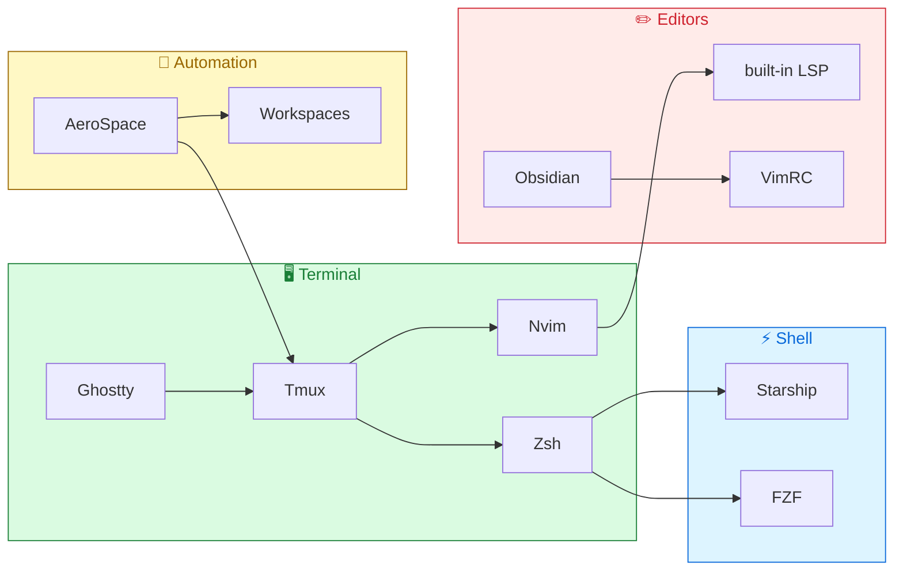

# dotfiles


Personal macOS development environment. Vim keybindings everywhere, GitLab-themed light/dark.

<p align="center">
  
</p>

## Quick Setup

```bash
git clone https://github.com/snesjhon/dotfiles.git ~/Developer/dotfiles
```

Then symlink the configs you want (see [Symlink Map](#symlink-map)) and install the tools
listed under [Brewfile Snapshot](#brewfile-snapshot).

## What's Inside

```
dotfiles/
├── nvim/          Neovim config (native vim.pack, built-in LSP, snacks pickers)
├── tmux/          Terminal multiplexer, session management + scripts
├── zsh/           Shell config, vi mode, custom functions
├── ghostty/       Terminal emulator (GitLab theme, ligatures)
├── aerospace/     Tiling window manager + app/session hotkeys
├── starship/      Minimal cross-shell prompt
├── obsidian/      Vim keybindings for Obsidian
├── yazi/          Terminal file manager (GitLab themed)
├── bat/           Pager theme (follows macOS light/dark)
└── scripts/       Standalone helper scripts (fzf preview, PR base resolution)
```

## Architecture


```mermaid
graph LR
    subgraph Terminal["🖥 Terminal"]
        Ghostty --> Tmux
        Tmux --> Zsh
        Tmux --> Nvim
    end

    subgraph Shell["⚡ Shell"]
        Zsh --> Starship
        Zsh --> FZF
    end

    subgraph Automation["🔧 Automation"]
        AeroSpace --> Workspaces
        AeroSpace --> Tmux
    end

    subgraph Editors["✏️ Editors"]
        Nvim --> LSP["built-in LSP"]
        Obsidian --> VimRC
    end

    style Terminal fill:#dafbe1,stroke:#1a7f37,color:#1a7f37
    style Shell fill:#ddf4ff,stroke:#0969da,color:#0969da
    style Automation fill:#fff8c5,stroke:#9a6700,color:#9a6700
    style Editors fill:#ffebe9,stroke:#cf222e,color:#cf222e
```

## Highlights

### Neovim

`nvim/init.lua` + `nvim/lua/plugins.lua` using native `vim.pack` — no plugin manager. Every
`nvim/lua/configs/*.lua` is auto-required, so adding a file there is enough to wire it up.
Versions are pinned in `nvim-pack-lock.json`.

| Category       | Plugin                    | Purpose                                             |
| -------------- | ------------------------- | --------------------------------------------------- |
| LSP            | built-in `vim.lsp`        | `vtsls` + jdtls, config in `lua/lsp.lua`             |
| Completion     | `blink.cmp`               | Completion engine                                    |
| Theme          | `gitlab-nvim-theme`       | Follows macOS light/dark on `FocusGained`            |
| Pickers        | `snacks.nvim`             | Files/grep/LSP/git pickers, dashboard, lazygit       |
| Syntax         | `nvim-treesitter`         | Highlighting + `foldexpr`                            |
| Buffer tabs    | `bufferline.nvim`         | Buffer line with diagnostics (no statusline)         |
| Git signs      | `gitsigns.nvim`           | Hunks, blame, PR-base diff via `<leader>tp`          |
| Git diff       | `diffview.nvim`           | `:PrDiff` — review diff against the PR base          |
| Format         | `conform.nvim`            | Format on `gf`                                       |
| Keymap hints   | `which-key.nvim`          | Leader-key discovery                                 |
| Focus          | `no-neck-pain.nvim`       | Centered editing (`<leader>z`)                       |
| File browser   | `lua/configs/yazi.lua`    | Yazi chooser via `<F6>` / `:YaziChooser`             |

### Tmux

- **Prefix:** `C-a`
- **Smart pane nav:** `C-h`/`C-l` detect nvim and pass-through
- **Session switcher:** `tmux-session.sh`, fzf-driven (bound to AeroSpace `Meh+B`, see below)
- **Zen mode:** `prefix+g` toggles a centered pane via `tmux-zen.sh` — manual, per window, never automatic
- **Insert a file path:** `C-f` opens an fzf popup and types the pick into the current pane (`fzf-insert-picker.sh`); passes through to nvim untouched
- **Scratch terminal:** `C-S-t` toggles a floating, persistent popup session (`tmux-popup.sh`)
- **Theme:** Tokyo Night Storm via tmux-powerkit

### AeroSpace

Window management uses `alt` (Option); app launching and session switching use **Meh** (`Shift+Ctrl+Alt`):

**Window management**

| Key                        | Action                       |
| --------------------------- | ---------------------------- |
| `alt-h/j/k/l`               | Focus window                 |
| `alt-ctrl-h/j/k/l`          | Move window                  |
| `alt-1`…`alt-5`             | Switch to workspace 1–5      |
| `alt-a/s/d/f/g`             | Send window to workspace 1–5 |
| `alt-r` → `h/j/k/l`         | Resize mode                  |
| `alt-slash`                 | Toggle split direction       |
| `alt-comma`                 | Accordion (stack) layout     |
| `alt-period`                | Toggle float                 |
| `alt-m`                     | Back-and-forth workspace     |
| `alt-shift-tab`             | Focus next monitor           |
| `alt-shift-r`               | Reset workspaces             |
| `alt-shift-slash`           | Service mode (reset layout, close all but current) |

**App workspaces (Meh) & sessions**

| Key                | Action                                    |
| ------------------- | ------------------------------------------ |
| `Meh+A`             | Workspace 1 — Slack                       |
| `Meh+S`             | Workspace 2 — Obsidian                    |
| `Meh+D`             | Workspace 3 — Chrome                      |
| `Meh+F`             | Workspace 4 — Ghostty                     |
| `Meh+G`             | Workspace 5 — Ignition                    |
| `Meh+B`             | Tmux: dev session (`tmux-session.sh`)     |

Windows also auto-assign to workspaces on launch (Slack→1, Obsidian→2, Chrome→3, Ghostty→4, Ignition Designer→5) regardless of how they were opened.

### Zsh

- Vi keybindings (`bindkey -v`)
- Starship prompt; FZF colors follow macOS light/dark, matching bat/yazi/nvim's GitLab theme
- Custom fzf pickers (`zsh/functions/fzf-pickers.zsh`): `ff` (files), `fw` (live grep) — vim-style modal `j`/`k` nav, `ctrl-g` swaps between them. Picks open in an existing nvim pane when there is one.
- `y` — yazi wrapper that `cd`s the shell to yazi's exit directory
- `dev` — jump to `~/Developer/<project>` or run a script from `scripts/`

## Symlink Map

```
nvim/                    → ~/.config/nvim
tmux/tmux.conf           → ~/.tmux.conf
tmux/tmux-zen.sh         → ~/.config/tmux/tmux-zen.sh
zsh/zshenv               → ~/.zshenv
zsh/zshrc                → ~/.zshrc
zsh/zprofile             → ~/.zprofile
starship/starship.toml   → ~/.config/starship.toml
aerospace/aerospace.toml → ~/.aerospace.toml
obsidian/obsidian.vimrc  → ~/Developer/snesjhon/.obsidian.vimrc
yazi/                    → ~/.config/yazi
bat/config               → ~/.config/bat/config
ghostty/config.ghostty   → ~/Library/Application Support/com.mitchellh.ghostty/config.ghostty
~/Developer/gitlab-vim-theme/bat-themes → ~/.config/bat/themes
```

## Brewfile Snapshot

<details>
<summary>CLI Tools</summary>

`bash` `zsh` `zsh-autocomplete` `zsh-autosuggestions` `zsh-syntax-highlighting` `neovim` `tmux` `fzf` `ripgrep` `bat` `gh` `node` `nvm` `watchman` `lazygit` `fd` `starship` `coreutils` `yazi`

</details>

<details>
<summary>GUI Apps</summary>

`aerospace` `ghostty` `google-chrome` `monitorcontrol` `obsidian` `voiceink` `font-psudofont-liga-mono`

</details>
