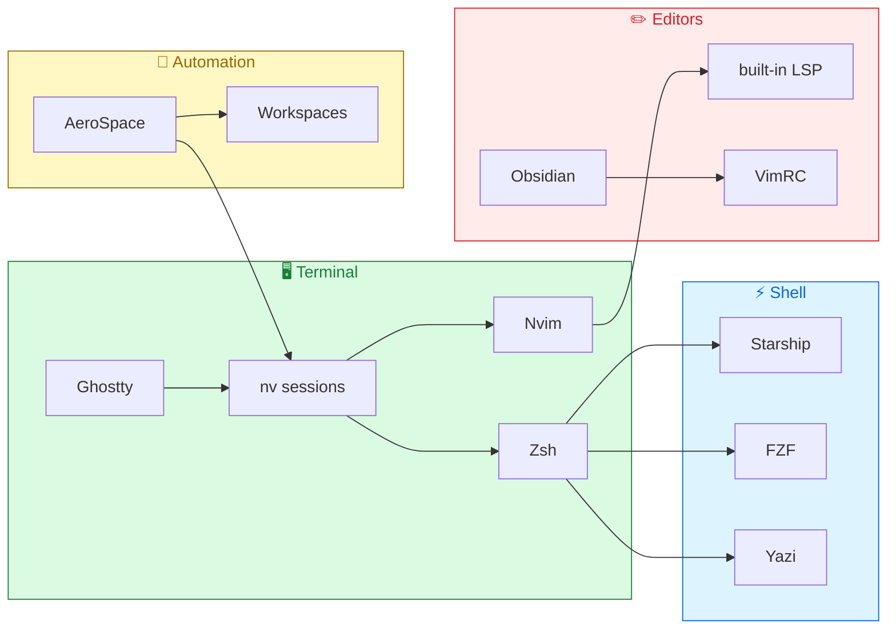

# dotfiles


Personal macOS development environment. Vim keybindings everywhere, GitLab-themed light/dark that follows the macOS appearance.

<p align="center">
  
</p>

## Quick Setup

```bash
git clone https://github.com/snesjhon/dotfiles.git ~/Developer/dotfiles
```

Then symlink the configs you want into place.

## What's Inside

```
dotfiles/
├── nvim/          Neovim config (native vim.pack, built-in LSP, snacks pickers, terminal sessions)
├── zsh/           Shell config, vi mode, fzf pickers, nv session launcher
├── ghostty/       Terminal emulator (GitLab theme, ligatures, no titlebar)
├── aerospace/     Tiling window manager + app/session hotkeys
├── starship/      Minimal cross-shell prompt
├── obsidian/      Vim keybindings and CSS for Obsidian
├── yazi/          Terminal file manager (GitLab themed)
├── bat/           Pager theme (follows macOS light/dark)
└── scripts/       Helper scripts (fzf preview, PR base resolution, nvim session launcher)
```

## Architecture


```mermaid
graph LR
    subgraph Terminal["🖥 Terminal"]
        Ghostty --> Sessions["nv sessions"]
        Sessions --> Zsh
        Sessions --> Nvim
    end

    subgraph Shell["⚡ Shell"]
        Zsh --> Starship
        Zsh --> FZF
        Zsh --> Yazi
    end

    subgraph Automation["🔧 Automation"]
        AeroSpace --> Workspaces
        AeroSpace --> Sessions
    end

    subgraph Editors["✏️ Editors"]
        Nvim --> LSP["built-in LSP"]
        Obsidian --> VimRC
    end

    style Terminal fill:#dafbe1,stroke:#1a7f37,color:#1a7f37
    style Shell fill:#ddf4ff,stroke:#0969da,color:#0969da
    style Automation fill:#fff8c5,stroke:#9a6700,color:#9a6700
    style Editors fill:#ffebe9,stroke:#cf222e,color:#cf222e
```
