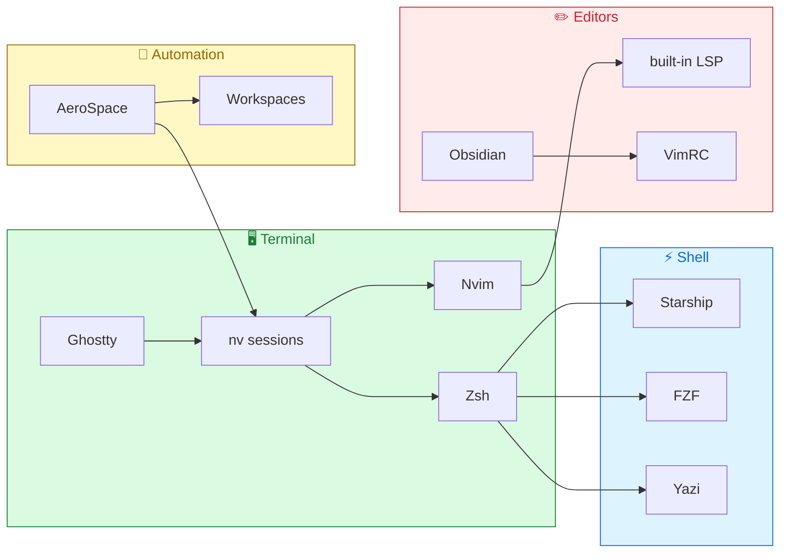

# dotfiles


Personal macOS development environment. Vim keybindings everywhere, GitLab-themed light/dark that follows the macOS appearance.

<p align="center">
  
</p>

## Quick Setup

```bash
git clone https://github.com/snesjhon/dotfiles.git ~/Developer/dotfiles
```

Then symlink the configs you want (see [Symlink Map](#symlink-map)) and install the tools
listed under [Brewfile Snapshot](#brewfile-snapshot).

## What's Inside

```
dotfiles/
├── nvim/          Neovim config (native vim.pack, built-in LSP, snacks pickers, terminal sessions)
├── zsh/           Shell config, vi mode, fzf pickers, nv session launcher
├── ghostty/       Terminal emulator (GitLab theme, ligatures, no titlebar)
├── aerospace/     Tiling window manager + app/session hotkeys
├── starship/      Minimal cross-shell prompt
├── obsidian/      Vim keybindings and CSS for Obsidian
├── yazi/          Terminal file manager (GitLab themed)
├── bat/           Pager theme (follows macOS light/dark)
└── scripts/       Helper scripts (fzf preview, PR base resolution, nvim session launcher)
```

## Architecture


```mermaid
graph LR
    subgraph Terminal["🖥 Terminal"]
        Ghostty --> Sessions["nv sessions"]
        Sessions --> Zsh
        Sessions --> Nvim
    end

    subgraph Shell["⚡ Shell"]
        Zsh --> Starship
        Zsh --> FZF
        Zsh --> Yazi
    end

    subgraph Automation["🔧 Automation"]
        AeroSpace --> Workspaces
        AeroSpace --> Sessions
    end

    subgraph Editors["✏️ Editors"]
        Nvim --> LSP["built-in LSP"]
        Obsidian --> VimRC
    end

    style Terminal fill:#dafbe1,stroke:#1a7f37,color:#1a7f37
    style Shell fill:#ddf4ff,stroke:#0969da,color:#0969da
    style Automation fill:#fff8c5,stroke:#9a6700,color:#9a6700
    style Editors fill:#ffebe9,stroke:#cf222e,color:#cf222e
```

## Highlights

### Neovim

`nvim/init.lua` + `nvim/lua/plugins.lua` using native `vim.pack`, no plugin manager. Every
`nvim/lua/configs/*.lua` is auto-required, so adding a file there is enough to wire it up.
Versions are pinned in `nvim-pack-lock.json`.

| Category      | Plugin               | Purpose                                                  |
| ------------- | -------------------- | -------------------------------------------------------- |
| LSP           | built-in `vim.lsp`   | `vtsls` + `jsonls`, config in `lua/lsp.lua`              |
| Completion    | `blink.cmp`          | Completion engine (`C-j`/`C-k` to move)                  |
| Theme         | `gitlab-nvim-theme`  | Follows macOS light/dark                                 |
| Pickers       | `snacks.nvim`        | Files/grep/LSP/git pickers, dashboard, lazygit, terminal |
| Syntax        | `nvim-treesitter`    | Highlighting for JS/TS/TSX/JSON/Java                     |
| Buffer tabs   | `bufferline.nvim`    | Buffer line with diagnostics (no statusline)             |
| Git signs     | `gitsigns.nvim`      | Hunks, blame, PR-base diff via `<leader>gtp`             |
| Git diff      | `diffview.nvim`      | `:PrDiff`, review the diff against the PR base           |
| Format        | `conform.nvim`       | Prettier on `gf`                                         |
| Keymap hints  | `which-key.nvim`     | Leader-key discovery                                     |
| Focus         | `no-neck-pain.nvim`  | Centered editing (`<leader>z`)                           |
| Split nav     | `smart-splits.nvim`  | `C-h/j/k/l` to move between splits                       |

Other handy keys: `<F6>` opens yazi as a file chooser, `<C-S-o>` toggles a terminal on the
right, `<C-S-m>` runs `:PrDiff`.

### Terminal sessions (`nv`)

Replaces a terminal multiplexer with nvim itself. Each session is a headless nvim server where
every tab is a shell, so it keeps running when the Ghostty window closes.

- `nv` picks a session with fzf; `nv <name>` attaches to it directly; `nv kill` stops every session
- Sessions are defined in `nvim/lua/session_defs.lua` (`dev` opens `code`, `agent` and `server` tabs in `~/Developer`)
- `scripts/nv-session.sh <name>` brings up a session in Ghostty, switching the open window if there is one (bound to `Meh+K`)
- The bottom bar shows the session name, tabs and a clock

| Key                 | Action                                     |
| ------------------- | ------------------------------------------ |
| `C-S-,` / `C-S-.`   | Previous / next tab                        |
| `C-M-S-n`           | New tab                                    |
| `C-M-S-q`           | Close tab (the last one ends the session)  |
| `C-M-S-s`           | Switch session                             |
| `C-\`               | Copy mode (passes through to a nested nvim) |
| `C-S-u` / `C-S-i`   | Find files / grep                          |
| `C-S-y`             | Yazi                                       |
| `C-S-n`             | LazyGit                                    |

The launcher keys use nvim's own picker when nvim is in front, type the shell command into an
idle shell, and open a new tab otherwise. `:TabRename` names a tab.

### AeroSpace

Window management uses `alt` (Option); app launching and session switching use **Meh** (`Shift+Ctrl+Alt`):

**Window management**

| Key                   | Action                       |
| --------------------- | ---------------------------- |
| `alt-h/j/k/l`         | Focus window                 |
| `alt-ctrl-h/j/k/l`    | Move window                  |
| `alt-1`…`alt-7`       | Switch to workspace 1–7      |
| `alt-a/s/d/f/g/c/z`   | Send window to workspace 1–7 |
| `alt-r` → `h/j/k/l`   | Resize mode                  |
| `alt-slash`           | Toggle split direction       |
| `alt-comma`           | Accordion (stack) layout     |
| `alt-period`          | Toggle float                 |
| `alt-m`               | Back-and-forth workspace     |
| `alt-shift-semicolon` | Reload config                |

**App workspaces (Meh) & sessions**

| Key              | Action                                       |
| ---------------- | -------------------------------------------- |
| `Meh+A`          | Workspace 1, Slack                           |
| `Meh+S`          | Workspace 2, Obsidian                        |
| `Meh+D`          | Workspace 3, Chrome                          |
| `Meh+F`          | Workspace 4, Ghostty                         |
| `Meh+G`          | Workspace 5, Ignition Designer               |
| `Meh+C`          | Workspace 6, Trackit                         |
| `Meh+Z`          | Workspace 7, Music                           |
| `Meh+K`          | `dev` nvim session (`nv-session.sh dev`)     |

Windows also auto-assign to workspaces on launch (Slack→1, Obsidian→2, Chrome→3, Ghostty→4,
Ignition Designer→5, Trackit→6, Music→7) regardless of how they were opened. Finder, System
Settings, Calculator, Activity Monitor and Messages always float.

### Zsh

- Vi keybindings (`bindkey -v`); `Tab` accepts the autosuggestion, `C-Space` cycles completions
- Starship prompt; fzf, bat and yazi colors follow macOS light/dark, matching nvim's GitLab theme
- fzf pickers (`zsh/functions/fzf-pickers.zsh`): `ff` (files) and `fw` (live grep), shown inline below the prompt like `Ctrl-r` history. Vim-style modal `j`/`k` nav, `ctrl-g` swaps between them, `alt-.` includes hidden/ignored files
- `nv`: nvim terminal sessions (see above)
- `y`: yazi wrapper that `cd`s the shell to yazi's exit directory
- `dev`: jump to `~/Developer/<project>` or run a script from `scripts/`
- Aliases: `v` (nvim), `gg` (lazygit), `gs` (git status), `cc` (claude)

## Symlink Map

```
nvim/                    → ~/.config/nvim
zsh/zshenv               → ~/.zshenv
zsh/zshrc                → ~/.zshrc
zsh/zprofile             → ~/.zprofile
starship/starship.toml   → ~/.config/starship.toml
aerospace/aerospace.toml → ~/.aerospace.toml
obsidian/obsidian.vimrc  → ~/Developer/snesjhon/.obsidian.vimrc
yazi/                    → ~/.config/yazi
bat/config               → ~/.config/bat/config
ghostty/config.ghostty   → ~/Library/Application Support/com.mitchellh.ghostty/config.ghostty
~/Developer/gitlab-vim-theme/bat-themes → ~/.config/bat/themes
```

## Brewfile Snapshot

<details>
<summary>CLI Tools</summary>

`bash` `zsh` `zsh-autocomplete` `zsh-autosuggestions` `zsh-syntax-highlighting` `neovim` `fzf` `ripgrep` `bat` `gh` `node` `nvm` `watchman` `lazygit` `fd` `starship` `coreutils` `yazi`

</details>

<details>
<summary>GUI Apps</summary>

`aerospace` `ghostty` `google-chrome` `monitorcontrol` `obsidian` `voiceink` `font-psudofont-liga-mono`

</details>
