# dotfiles


Personal macOS development environment. Vim keybindings everywhere, GitHub-themed light/dark, one-command bootstrap.

<p align="center">
  
</p>

## Quick Setup

```bash
git clone https://github.com/snesjhon/dotfiles.git ~/Developer/dotfiles
cd ~/Developer/dotfiles/os
./install.sh
```

The install script handles everything: Homebrew, packages, symlinks, tmux plugins, Claude Code skills, and npm globals.

## What's Inside

```
dotfiles/
├── nvim/          AstroNvim v5 config with 20+ plugins
├── tmux/          Terminal multiplexer + session management
├── zsh/           Shell config, vim mode, custom functions
├── ghostty/       Terminal emulator (GitHub theme, ligatures)
├── hammerspoon/   macOS hotkeys & window management
├── starship/      Minimal cross-shell prompt
├── obsidian/      Vim keybindings for Obsidian
├── claude/        Custom Claude Code skills (LeetCode prep)
├── formatters/    Prettier config
└── os/            Bootstrap scripts & Brewfile
```

## Architecture

```mermaid
graph LR
    subgraph Terminal["🖥 Terminal"]
        Ghostty --> Tmux
        Tmux --> Zsh
        Tmux --> Neovim
    end

    subgraph Shell["⚡ Shell"]
        Zsh --> Starship
        Zsh --> Zoxide
        Zsh --> FZF
    end

    subgraph Automation["🔧 Automation"]
        Hammerspoon --> Ghostty
        Hammerspoon --> Tmux
        Sesh --> Tmux
    end

    subgraph Editors["✏️ Editors"]
        Neovim --> AstroNvim
        Obsidian --> VimRC
    end

    style Terminal fill:#dafbe1,stroke:#1a7f37,color:#1a7f37
    style Shell fill:#ddf4ff,stroke:#0969da,color:#0969da
    style Automation fill:#fff8c5,stroke:#9a6700,color:#9a6700
    style Editors fill:#ffebe9,stroke:#cf222e,color:#cf222e
```



## Highlights

### Neovim

AstroNvim v5 framework with Lazy.nvim. Key plugins:

| Category   | Plugin              | Purpose                              |
| ---------- | ------------------- | ------------------------------------ |
| Theme      | `github-nvim-theme` | Light/dark follows system appearance |
| Completion | `blink.cmp`         | Fast, cursor-based completion        |
| Navigation | `flash.nvim`        | Jump anywhere with `s`               |
| Markdown   | `markview.nvim`     | In-editor markdown preview           |
| Git        | `diffview.nvim`     | Side-by-side diffs                   |
| Focus      | `no-neck-pain.nvim` | Centered editing (119 cols)          |
| Fun        | `leetcode.nvim`     | Solve problems in-editor             |

### Tmux

- **Prefix:** `C-a`
- **Smart pane nav:** `C-h`/`C-l` detect vim and pass-through
- **Session management:** Sesh + FZF with GitHub-themed picker
- **Zen mode:** `prefix + z`
- **Theme:** Tokyo Night Storm via tmux-powerkit

### Hammerspoon

All hotkeys use the **Meh** modifier (`Shift+Ctrl+Alt`):

| Key               | Action                   |
| ----------------- | ------------------------ |
| `Meh+F`           | Launch Ghostty           |
| `Meh+D`           | Launch Chrome            |
| `Meh+S`           | Launch Obsidian          |
| `Meh+A`           | Launch Music             |
| `Meh+E`           | Tmux: leetcode session   |
| `Meh+R`           | Tmux: dotfiles session   |
| `Meh+N` / `Meh+.` | Window left / right half |
| `Meh+M`           | Maximize window          |

### Zsh

- Vim keybindings (`bindkey -v`)
- Starship prompt + Zoxide for fast navigation
- FZF integration with light theme
- Custom `dev` function for project navigation
- Auto-sourced functions from `zsh/functions/`

## Symlink Map

```
nvim/           → ~/.config/nvim/
tmux/tmux.conf  → ~/.tmux.conf
zsh/.zshrc      → ~/.zshrc
starship.toml   → ~/.config/starship.toml
ghostty/config  → ~/.config/ghostty/config
obsidian.vimrc  → ~/.obsidian.vimrc
```

## Brewfile Snapshot

<details>
<summary>CLI Tools</summary>

`neovim` `tmux` `fzf` `ripgrep` `tree-sitter` `gh` `node` `nvm` `python3` `sesh` `zoxide` `starship` `zsh-autocomplete` `zsh-autosuggestions` `zsh-syntax-highlighting`

</details>

<details>
<summary>GUI Apps</summary>

`ghostty` `google-chrome` `monitorcontrol` `obsidian` `hammerspoon`

</details>

<details>
<summary>Fonts</summary>

`font-symbols-only-nerd-font`

</details>
