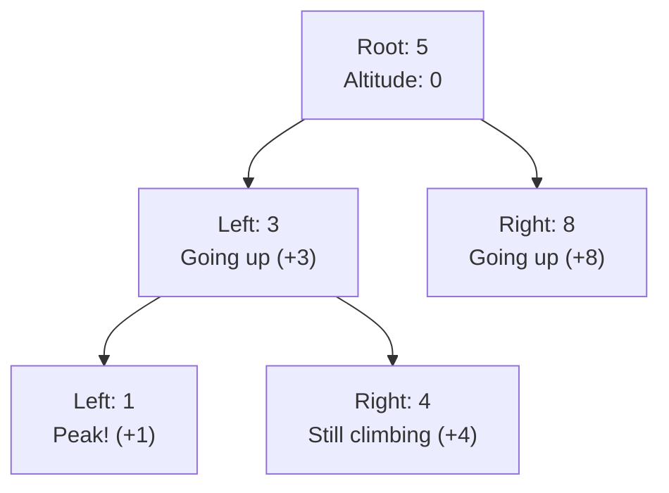
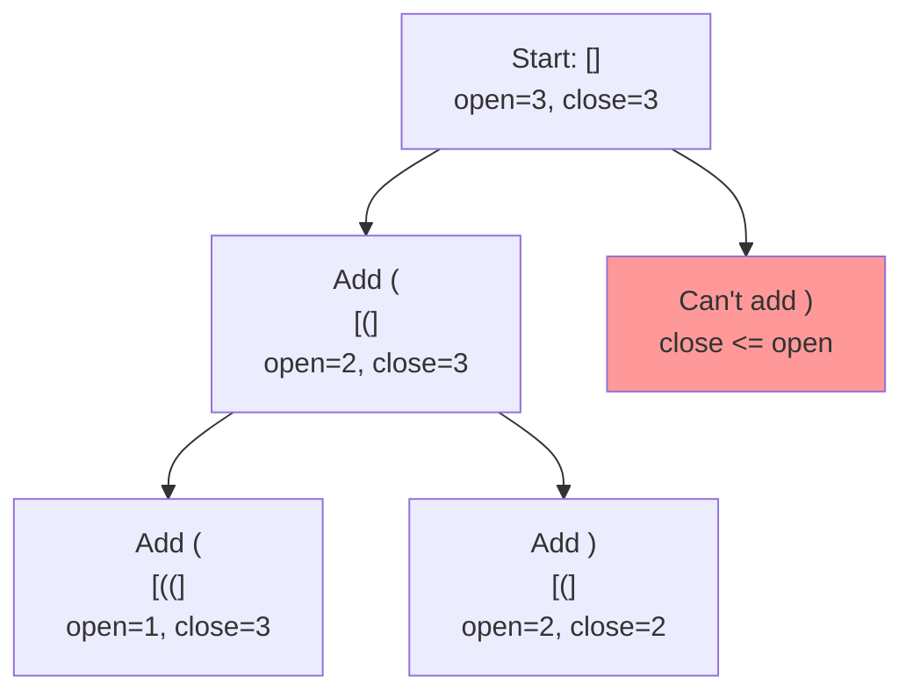
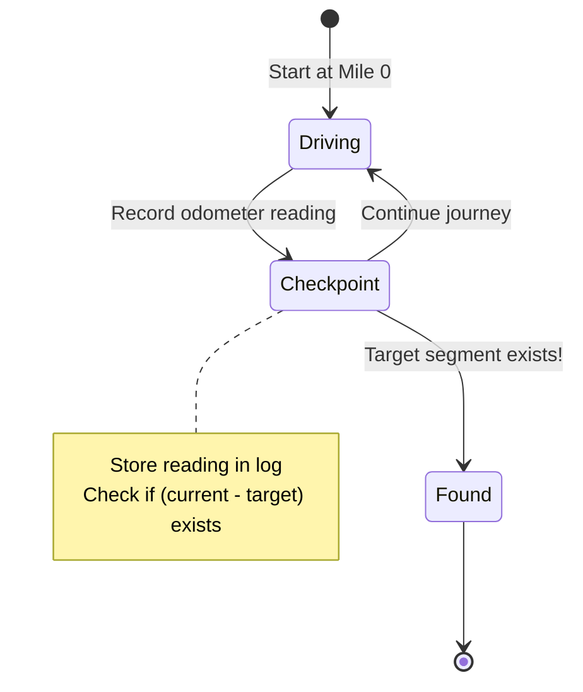
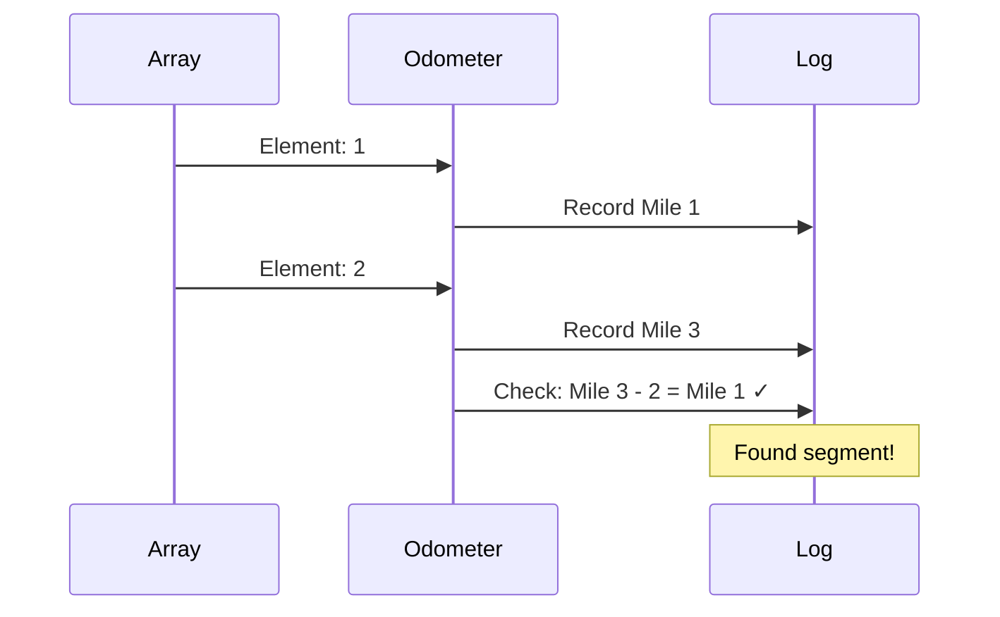

# Project Preferences for Leetcode

## Study Guides Location
- Always create study guide directories in `/Users/snesjhon/Developer/snesjhon/ysk/study-guides/`
- Never create directories in the leetcode folder itself
- Use the format: `/Users/snesjhon/Developer/snesjhon/ysk/study-guides/[problem-number]-[problem-name]/`

## Required Workflow
1. Create mental-model.md with mermaid charts for visualizations
2. **MUST validate all mermaid charts** using the validation script
3. Fix any validation errors before considering the file complete
4. Never ship a mental model with unvalidated or broken mermaid charts

**Validation command:**
```bash
~/Developer/dotfiles/claude/skills/leet-mental/validate-mermaid.sh mental-model.md
```

---

## Creating Mental Model Files

### Core Principles

1. **Start with an analogy** - Use real-world metaphors that make the abstract concrete
2. **Build from ground up** - Start with the simplest case, show the pattern emerging
3. **Focus on intuition, not math** - Avoid formulas and equations until after understanding
4. **Use clear visualizations** - Prefer tables and simple diagrams over text explanations
5. **Explain every piece** - Never assume understanding of any component

### Structure Template

```markdown
# [Problem Name] - Mental Model

## The [Strong Analogy] Analogy

[Real-world metaphor that maps directly to the algorithm]
- Component A in algorithm = Thing X in real world
- Component B in algorithm = Thing Y in real world

## Building from the Ground Up

### The Simplest Case: [minimal example]

[Trace through with actual values, showing each step]

### Adding Complexity: [slightly larger example]

[Show how the pattern scales, what changes]

## What Just Happened?

[Reflect on the insight discovered, not just mechanics]

## Why [Key Component] Works This Way

[Explain the "why" behind design decisions with concrete examples]

## Why Not [Alternative Approach]?

[Compare to simpler/obvious approaches with concrete numbers]

## Common Misconceptions

### ❌ "[Wrong assumption]"
[Why it's wrong with concrete example]

### ✅ "[Correct understanding]"
[Why it's right]

## Try It Yourself

[Hands-on exercise for the reader to trace]

## The Algorithm in Plain English

[Step-by-step without code, using analogy terms]

## Complete Solution

[Actual code with comments referencing the analogy]
```

### Visualization Guidelines

**USE MERMAID CHARTS FOR:**
- Tree/graph structures (binary trees, graphs, decision trees)
- Flow diagrams showing algorithm progression
- State transitions and recursion paths
- Sequence of operations over time

**USE TABLES FOR:**
- State changes across steps with multiple variables
- Comparison of values at different stages
- Lookup tables and mappings

**Mermaid Chart Best Practices:**
- Always validate charts with `mmdc` before considering them complete
- Label nodes with concrete values from your example (not abstract variables)
- Use analogy-based labels (e.g., "Mile 70" instead of "sum=70")
- Keep hierarchy clear with proper indentation
- Include legend or key when needed

**DON'T:**
- Don't use abstract variable names in diagrams
- Don't skip showing intermediate states
- Don't create charts without validating them first

### Mermaid Chart Examples by Problem Type

**Binary Tree Problems:**


**Backtracking/Decision Trees:**


**State Machine/Flow:**


**Sequence/Timeline:**


### Validating Mermaid Charts

**CRITICAL: Always validate charts before completion**

After creating a mental model with mermaid charts, you MUST validate them:

```bash
# Run the validation script on your mental-model.md file
~/Developer/dotfiles/claude/skills/leet-mental/validate-mermaid.sh mental-model.md
```

The script will:
1. Extract all mermaid blocks from the markdown file
2. Validate each chart using `mmdc`
3. Report which charts are valid or have errors
4. Exit with error code if any chart is invalid

**Validation workflow:**
1. Create mental-model.md with mermaid charts
2. Run validation script
3. If errors found: fix the mermaid syntax and re-run
4. Only consider the file complete when all charts pass validation

The validation ensures charts render correctly in GitHub, Obsidian, and other markdown viewers.

**Manual validation (alternative):**
```bash
# Extract a single chart and test it
mmdc -i chart.mmd -o /dev/null
```

### Example: Good vs Bad Explanations

**❌ BAD:**
```
We check if (current_sum - k) exists in the hashmap.
If it does, we found a subarray.
```

**✅ GOOD:**
```
Imagine your car's odometer shows 100 miles.
If you want to find when you drove exactly 30 miles,
you look in your logbook for when the odometer read 70.
The segment between 70 and 100 is exactly 30 miles!
```

### Analogies That Work Well

**Subarray Sum Problems:**
- Odometer/checkpoint journey (running sums as cumulative distances)
- Bank account balance (deposits/withdrawals)

**Tree Problems:**
- Mountain climbing (going up/down)
- Organization hierarchy (parent/child relationships)
- Family tree (ancestors/descendants)

**Backtracking:**
- Exploring a maze (try paths, backtrack from dead ends)
- Building something step-by-step with rules

**Graph Problems:**
- Social network (people as nodes, friendships as edges)
- City map (cities as nodes, roads as edges)

### Variable Naming in Solutions

When implementing with the analogy:
- Use analogy-based names: `odoLog`, `milesDriven`, `segmentsFound`
- Avoid generic names: `map`, `sum`, `count`
- Make the connection to mental model obvious

**Example:**
```typescript
// ✅ GOOD - Uses analogy
const odoLog = new Map();
let milesDriven = 0;
const targetReading = milesDriven - k;

// ❌ BAD - Generic
const map = new Map();
let sum = 0;
const target = sum - k;
```

### Testing Your Mental Model

Before considering a mental model complete, verify:

1. **Can you explain it without code?** Walk through an example verbally
2. **Does it answer "why"?** Not just "what" or "how"
3. **Can you predict behavior?** Given new inputs, can you trace the outcome
4. **Does it handle edge cases?** Explain why base cases exist
5. **Is it memorable?** Will you remember the analogy days later

### What to Avoid

- ❌ Starting with "The algorithm does X"
- ❌ Using mathematical notation before intuition
- ❌ Comparing multiple approaches upfront (do this after understanding one)
- ❌ Assuming knowledge of data structures (explain why hashmap vs array)
- ❌ Skipping the "why this exists" for each component
- ❌ Using confusing phrasing like "subtract an old running total"
- ❌ Missing the progression from simple to complex examples

### Reference Examples

**Excellent mental models:**
- `/Users/snesjhon/Developer/snesjhon/ysk/study-guides/022-generate-parentheses/mental-model.md`
  - Uses mountain climbing analogy
  - Builds from n=1 to n=3
  - Explains constraints naturally

- `/Users/snesjhon/Developer/snesjhon/ysk/study-guides/560-subarray-sum-equals-k/mental-model.md`
  - Uses odometer/checkpoint analogy
  - Shows why hashmap stores counts
  - Traces duplicate readings clearly
