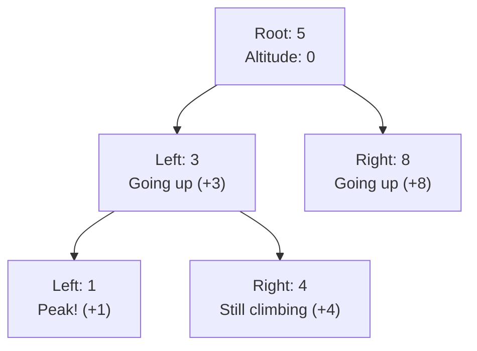
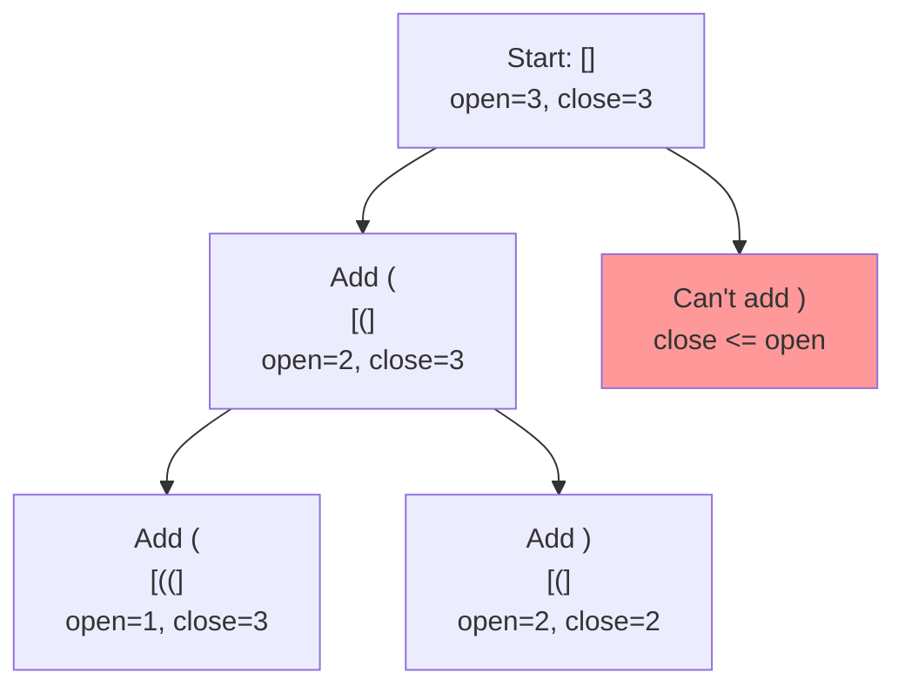
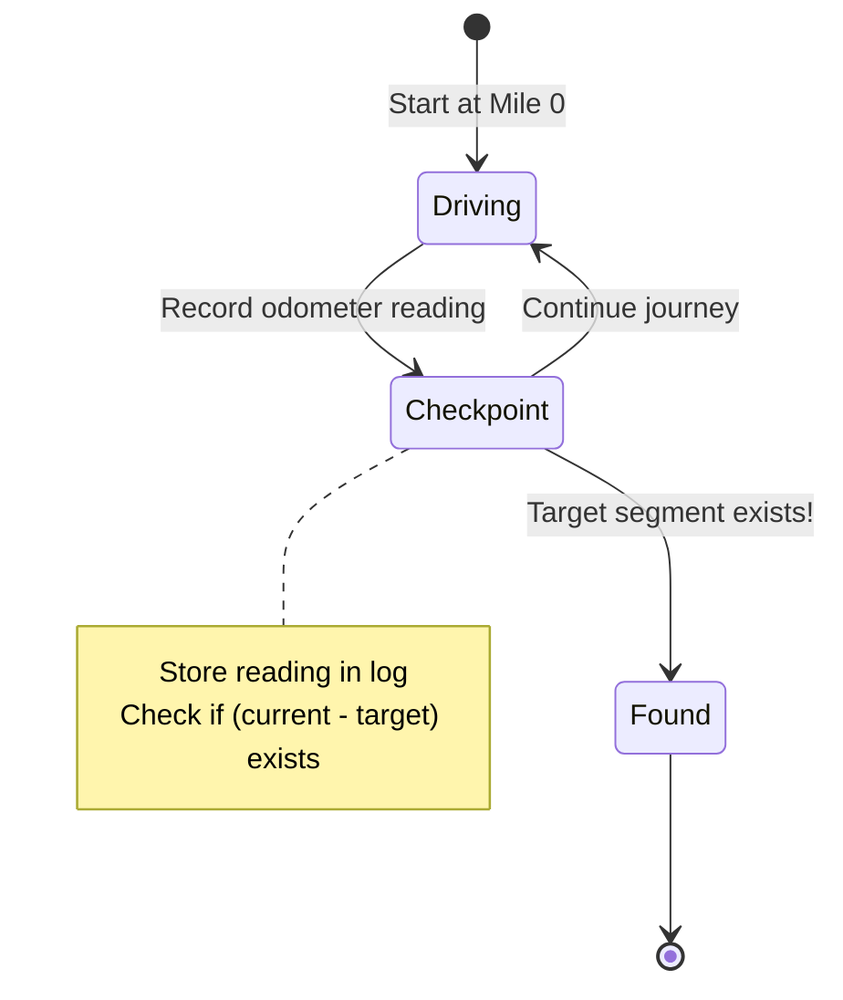
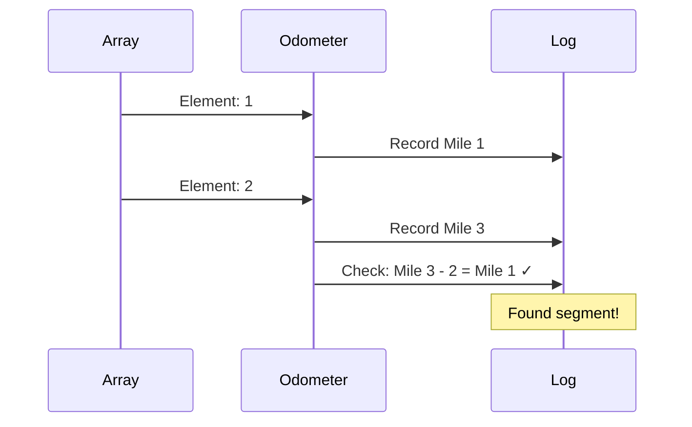

# Mental Model Building for LeetCode Problems

## Purpose
This skill creates mental model study guides that help understand algorithm concepts through **a single, powerful analogy**.

**What this skill does:**
- Builds deep understanding of the problem and solution approach
- Explains the "why" behind algorithmic choices
- Creates memorable mental models using real-world analogies

**What this skill does NOT do:**
- Analyze or debug existing code
- Fix bugs in implementations
- Review or critique current solutions
- Compare multiple solution approaches

## Study Guides Location
- Always create study guide directories in `/Users/snesjhon/Developer/snesjhon/ysk/study-guides/`
- Never create directories in the leetcode folder itself
- Use the format: `/Users/snesjhon/Developer/snesjhon/ysk/study-guides/[problem-number]-[problem-name]/`

## Required Workflow
1. Choose ONE powerful analogy and commit to it
2. **Phase 1:** Write substantial analogy section explaining the mental model (NO CODE yet)
3. **Phase 2:** Build the algorithm incrementally, translating analogy concepts to code
4. Create mental-model.md using only that analogy throughout
5. Use mermaid charts for visualizations
6. **MUST validate all mermaid charts** using the validation script
7. Fix any validation errors before considering the file complete
8. **DO NOT create README.md or any other summary documents** - only create mental-model.md

**Validation command:**
```bash
~/Developer/dotfiles/claude/skills/leet-mental/validate-mermaid.sh mental-model.md
```

---

## Core Principles

1. **Choose ONE analogy and commit** - Select a single real-world metaphor and use it consistently
2. **Build the mental model FIRST** - Fully explain the analogy before introducing any code
3. **Stay in the analogy** - Never break character; keep all explanations using analogy terms
4. **Build from ground up** - Start with the simplest case, show the pattern emerging
5. **Focus on intuition, not math** - Avoid formulas and equations until after understanding
6. **Use clear visualizations** - Leverage mermaid charts and tables
7. **Explain every piece** - Never assume understanding of any component
8. **⭐ THEN BUILD CODE INCREMENTALLY** - After the mental model is solid, translate each analogy concept to code piece by piece

## Two-Phase Approach: Mental Model First, Then Code

**CRITICAL: Build understanding in two distinct phases.**

### Phase 1: Build the Mental Model (No Code Yet!)

First, thoroughly explain the analogy in plain English:
1. **Introduce the analogy** and map concepts
2. **Walk through the analogy** with concrete examples
3. **Explain the intuition** behind why it works
4. **Show the pattern** using the analogy's natural flow

The reader should fully understand the problem through the analogy BEFORE seeing any code.

### Phase 2: Translate to Code

After the mental model is solid, then show the code:
1. **Analogy concept** → **Specific code logic**
2. **Incrementally build** the algorithm piece by piece
3. **Each section adds code** that maps to an analogy concept they already understand

### Why This Matters

If you jump into code too early, readers don't have the mental framework to understand it. They need to first "see" the solution through the analogy, then learn how to express it in code.

### The Wrong Way

❌ **Jumping into code too quickly:**
```
## The Factory Analogy

In our factory, an inspector checks items on a belt.

## Building the Algorithm

**In code:**
[Dump code with minimal analogy explanation]
```

This doesn't give the reader time to internalize the mental model before seeing code.

### The Right Way

✅ **Build mental model first, then translate to code:**

```markdown
## The Factory Quality Control Analogy

Understanding this problem is like a factory quality control process.

## Understanding the Analogy (No Code Yet!)

### The Setup

Imagine a factory production line with items on a conveyor belt. Some items are defective (marked with value `val`), and some are good. We need to compact the belt so all good items are at the front, with defective items removed or pushed to the back.

We have:
- A **storage position** that tracks where the next good item should go (starts at position 0)
- An **inspector** who walks the belt from start to finish
- A **rule**: Good items get placed at the storage position, defective items are skipped

### How It Works

The inspector starts at the beginning of the belt and examines each item one by one. When they find a good item, they place it at the current storage position and advance the storage counter. When they find a defective item, they simply skip it and move to the next item.

The key insight: by using a separate storage position, we can compact items in-place. The storage position is always ≤ the inspector's position, so we never overwrite items we haven't inspected yet.

### Simple Example Through the Analogy

Belt: [3, 2, 2, 3], Remove value: 3

- Inspector at position 0, item 3 (defective) → skip, storage stays at 0
- Inspector at position 1, item 2 (good) → place at storage position 0, storage now 1
- Inspector at position 2, item 2 (good) → place at storage position 1, storage now 2
- Inspector at position 3, item 3 (defective) → skip, storage stays at 2

Final storage count: 2 (we have 2 good items)

Now you understand HOW to solve the problem. Let's translate this to code.

---

## Building the Algorithm Step-by-Step

### Step 1: Setting Up the Storage Position

**In our analogy:** We need a counter to track where the next good item goes.

**In code:**
```typescript
let storageSlot = 0;  // Next position for good items
```

### Step 2: The Inspector Walks the Belt

**In our analogy:** The inspector examines each item from start to finish.

**Adding to our code:**
```typescript
let storageSlot = 0;

for (let inspector = 0; inspector < nums.length; inspector++) {
    // Inspector is now examining position 'inspector'
}
```

### Step 3: Checking Each Item

**In our analogy:** If item is good, place it at storage position and advance. If defective, skip.

**The logic:**
```typescript
let storageSlot = 0;

for (let inspector = 0; inspector < nums.length; inspector++) {
    if (nums[inspector] !== val) {  // Good item!
        nums[storageSlot] = nums[inspector];  // Place it
        storageSlot++;                         // Advance storage
    }
    // If defective, skip (do nothing)
}
```

### Step 4: Return the Count

**In our analogy:** The storage position tells us how many good items we found.

**Complete algorithm:**
```typescript
function removeElement(nums: number[], val: number): number {
    let storageSlot = 0;

    for (let inspector = 0; inspector < nums.length; inspector++) {
        if (nums[inspector] !== val) {
            nums[storageSlot] = nums[inspector];
            storageSlot++;
        }
    }

    return storageSlot;  // Count of good items
}
```
```

### The Two-Phase Pattern

**Phase 1: Build the Mental Model (Analogy Section)**
1. Setup - What do we have? What are we doing?
2. Process - How does it work step-by-step?
3. Intuition - Why does this work?
4. Example - Walk through using only analogy terms

**Phase 2: Translate to Code (Algorithm Section)**
1. Each subsection maps to a concept from the analogy
2. Brief reminder of the analogy concept
3. Show the code that implements it
4. Explain the connection

By the end, the reader has:
1. First understood the problem through the analogy
2. Then learned how to express that understanding in code

### Structure Template

```markdown
# [Problem Name] - Mental Model

## The [Single Analogy Name] Analogy

Understanding this problem is like [brief opening analogy statement].

## Understanding the Analogy (No Code Yet!)

[This section should be substantial - multiple paragraphs explaining the analogy in plain English]

### The Setup

[Explain the starting state in analogy terms]
- What do we have?
- What are we trying to accomplish?
- What are the constraints?

### How It Works

[Walk through the process using the analogy - 2-4 paragraphs]
- Step-by-step explanation in analogy terms
- Why each step makes sense
- How we make decisions at each point

### Why This Approach

[Explain the intuition - 1-2 paragraphs]
- Why this approach works
- What makes it efficient
- The key insight

## How I Think Through This

[Paragraph 1 — Plain first-person walkthrough of the algorithm. Start with what the problem is really asking, then explain the core insight that makes the approach work. Name every key variable inline and say what it represents. Walk through what happens at each step — what you set up, what decision you make, and why. Call out the one rule or habit that makes the algorithm correct (e.g. "writing before updating is the key"). End by stating what the final state holds. Use programmatic terms naturally in the prose — variable names, pass directions, data structure names — but never show code. Write it the way you'd talk yourself through it at a whiteboard.]

[Paragraph 2 — Concrete trace through a short example. Open with "Take `[...]`." then narrate each step: name the position, name the variable and its current value, state what operation happens and what the variable becomes. Show the intermediate state after the first pass if there are multiple passes. End with the final output. This should read like a live play-by-play, not a table or a proof.]

### Simple Example Through the Analogy

[Walk through a simple example using ONLY analogy terms]
- Input in analogy terms
- Each step in analogy terms
- Output in analogy terms

Now you understand HOW to solve the problem. Let's translate this to code.

---

## Building the Algorithm Step-by-Step

Now we'll translate each part of our mental model into code.

### Step 1: [First Analogy Concept]

**In our analogy:** [Brief reminder of this concept]

**In code:**
```typescript
// Show just this piece
let variable = initialValue;
```

**Why:** [Connect the code to the analogy concept]

### Step 2: [Second Analogy Concept]

**In our analogy:** [Brief reminder]

**Adding to our code:**
```typescript
let variable = initialValue;

for (let i = 0; i < input.length; i++) {
    // This loop represents [analogy concept]
}
```

**Why:** [Connection]

### Step 3: [Third Analogy Concept]

**In our analogy:** [Brief reminder]

**The logic:**
```typescript
let variable = initialValue;

for (let i = 0; i < input.length; i++) {
    if (condition) {  // In our analogy: [what this check means]
        // Take action
    }
}
```

**Why:** [Connection]

### Step 4: [Final Piece]

**In our analogy:** [Brief reminder]

**Complete algorithm:**
```typescript
function solveProblem(input: number[]): number {
    let variable = initialValue;

    for (let i = 0; i < input.length; i++) {
        if (condition) {
            // Action
        }
    }

    return variable;  // In analogy: [what this represents]
}
```

---

## Tracing Through an Example

[Use the same or similar example from earlier, now showing both analogy and code side-by-side]

**Input:** [concrete values]

[Table or step-by-step showing analogy state and code state together]

## Common Misconceptions

### ❌ "[Wrong assumption]"
Why it's wrong: [Counterexample in analogy terms, then show in code]

### ✅ "[Correct understanding]"
Why it's right: [Example in analogy terms, then show in code]

## Try It Yourself

[Exercise with:
1. Input in analogy terms
2. Expected analogy steps
3. Then what the code does
4. Expected output]
```

### Visualization Guidelines

**USE MERMAID CHARTS FOR:**
- Tree/graph structures (binary trees, graphs, decision trees)
- Flow diagrams showing algorithm progression
- State transitions and recursion paths
- Sequence of operations over time

**USE TABLES FOR:**
- State changes across steps with multiple variables
- Comparison of values at different stages
- Lookup tables and mappings

**Mermaid Chart Best Practices:**
- Always validate chart syntax before considering them complete
- Label nodes with concrete values from your example (not abstract variables)
- Use analogy-based labels (e.g., "Mile 70" instead of "sum=70")
- Keep hierarchy clear with proper indentation
- Include legend or key when needed

**DON'T:**
- Don't use abstract variable names in diagrams
- Don't skip showing intermediate states
- Don't create charts without validating them first

### Mermaid Chart Examples by Problem Type

**Binary Tree Problems:**


**Backtracking/Decision Trees:**


**State Machine/Flow:**


**Sequence/Timeline:**


### Validating Mermaid Charts

**CRITICAL: Always validate charts before completion**

After creating a mental model with mermaid charts, you MUST validate them:

```bash
# Run the validation script on your mental-model.md file
~/Developer/dotfiles/claude/skills/leet-mental/validate-mermaid.sh mental-model.md
```

The script will:
1. Extract all mermaid blocks from the markdown file
2. Validate basic syntax (diagram type, structure, common errors)
3. Report which charts pass syntax validation
4. Exit with error code if any chart has syntax errors

**Validation workflow:**
1. Create mental-model.md with mermaid charts
2. Run validation script
3. If errors found: fix the mermaid syntax and re-run
4. Only consider the file complete when all charts pass validation

**Note:** This performs basic syntax validation without rendering. Charts should still be visually verified in GitHub, Obsidian, or other markdown viewers.

### Example: Good vs Bad Explanations

**❌ BAD:**
```
We check if (current_sum - k) exists in the hashmap.
If it does, we found a subarray.
```

**✅ GOOD:**
```
Imagine your car's odometer shows 100 miles.
If you want to find when you drove exactly 30 miles,
you look in your logbook for when the odometer read 70.
The segment between 70 and 100 is exactly 30 miles!
```

### Choosing Your Single Analogy

**CRITICAL: Pick ONE analogy and commit to it completely.**

Don't mix analogies. Don't switch metaphors mid-explanation. The power comes from consistency.

#### Proven Analogies by Problem Type

**Subarray Sum Problems:**
- **Odometer journey** (running sums = cumulative distances traveled)
  - Why it works: Segments between checkpoints = subarrays
  - Natural fit for prefix sums, looking back at previous readings

**Tree Problems:**
- **Mountain climbing** (going up to children, down to parent)
  - Why it works: Height/altitude maps to depth, peaks = leaves
  - Natural fit for DFS, path concepts

**Backtracking:**
- **Maze exploration** (try paths, hit walls, backtrack)
  - Why it works: Dead ends = invalid states, retracing steps = backtracking
  - Natural fit for constraint checking, state restoration

**Graph Problems:**
- **City/road map** (cities = nodes, roads = edges)
  - Why it works: Distance, connectivity, paths all intuitive
  - Natural fit for BFS/DFS, shortest path

**Selection criteria:**
- Does every algorithm concept have a natural real-world parallel?
- Do edge cases make sense in the analogy?
- Will someone remember this analogy weeks later?
- Can you explain the entire solution without leaving the analogy?

**Reinforcement rule:** Once you pick the analogy, every example, trace, visualization label, variable name, and misconception must be expressed through that same analogy. Repetition of the analogy across different examples is what makes it stick. The reader should never encounter a second metaphor — if they do, the analogy wasn't strong enough and you should rework it rather than introduce another.

### Variable Naming in Solutions

When implementing with the analogy:
- Use analogy-based names: `odoLog`, `milesDriven`, `segmentsFound`
- Avoid generic names: `map`, `sum`, `count`
- Make the connection to mental model obvious

**Example:**
```typescript
// ✅ GOOD - Uses analogy
const odoLog = new Map();
let milesDriven = 0;
const targetReading = milesDriven - k;

// ❌ BAD - Generic
const map = new Map();
let sum = 0;
const target = sum - k;
```

### Testing Your Mental Model

Before considering a mental model complete, verify:

**Plain-Language Summary**
1. **First-person walkthrough:** Does paragraph 1 name key variables inline, call out the core rule, and explain why the approach works — all in plain prose without code?
2. **Concrete trace:** Does paragraph 2 open with "Take `[...]`.", walk through each step naming variable values, show intermediate state, and end with the final output?
3. **Self-contained memory aid:** Could you read both paragraphs, close your laptop, and reconstruct the algorithm on a whiteboard?

**Phase 1: Analogy Section**
4. **Single analogy test:** Did you stay in ONE analogy throughout — no secondary metaphors, no "it's also like..."?
5. **Reinforcement test:** Does every example reinforce the same analogy? Each new example should deepen the reader's comfort with the ONE analogy, not introduce fresh comparisons.
6. **Substantial explanation:** Does the analogy section have multiple paragraphs explaining the concept WITHOUT code?
7. **Complete mental model:** Can someone understand the solution approach from the analogy alone?
8. **Concrete example:** Did you walk through an example using ONLY analogy terms before introducing code?
9. **Clear intuition:** Does it explain WHY the approach works, not just WHAT it does?

**Phase 2: Code Section**
10. **Code built incrementally:** Does each section add code that maps to an analogy concept already explained?
11. **Clear mapping:** Can you point to which analogy concept corresponds to which line of code?
12. **Brief reminders:** Does each code section start with a brief reminder of the analogy concept?
13. **Progressive understanding:** By reading sequentially, does the algorithm build naturally without jumps?

**Overall:**
14. **Two distinct phases:** Is there a clear separation between "understanding the analogy" and "building the code"?
15. **Is it memorable?** Will you remember the analogy days/weeks later?
16. **No code analysis?** Did you avoid debugging or reviewing existing code?

**The ultimate test:** Can someone read the analogy section, fully understand the approach without seeing any code, and then easily follow the code section because they already have the mental model?

### What to Avoid

**Never do these:**
- ❌ Analyzing or debugging existing code implementations
- ❌ Fixing bugs in current solutions
- ❌ Reviewing code quality or suggesting refactors
- ❌ **Jumping into code before the analogy is fully explained**
- ❌ **Shallow analogy section (needs multiple paragraphs, not just bullet points)**
- ❌ Mixing multiple analogies or switching metaphors mid-explanation
- ❌ Introducing a second analogy to "clarify" the first — if the first analogy needs help, replace it with a better one
- ❌ Starting with "The algorithm does X" instead of analogy
- ❌ Breaking out of the analogy to use technical terms in the analogy section
- ❌ Using mathematical notation before building intuition
- ❌ Comparing multiple solution approaches (focus on understanding ONE way)
- ❌ Assuming knowledge of data structures (explain why through analogy)
- ❌ Skipping the "why this exists" for each component
- ❌ Using confusing phrasing like "subtract an old running total"
- ❌ Missing the progression from simple to complex examples
- ❌ Generic variable names (use analogy-based names always)
- ❌ Dumping complete code at the end instead of building it incrementally
- ❌ **Not having a clear break between "understanding the analogy" and "building the code"**

**Remember:**
- First: Build the mental model through the analogy (NO CODE)
- Then: Translate that mental model to code piece by piece

### Reference Examples

**Excellent mental models:**
- `/Users/snesjhon/Developer/snesjhon/ysk/study-guides/022-generate-parentheses/mental-model.md`
  - Uses mountain climbing analogy
  - Builds from n=1 to n=3
  - Explains constraints naturally

- `/Users/snesjhon/Developer/snesjhon/ysk/study-guides/560-subarray-sum-equals-k/mental-model.md`
  - Uses odometer/checkpoint analogy
  - Shows why hashmap stores counts
  - Traces duplicate readings clearly
