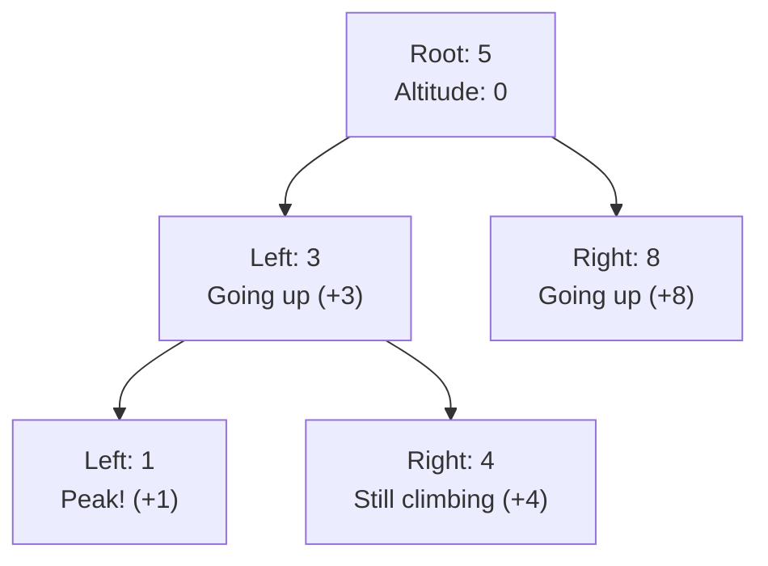
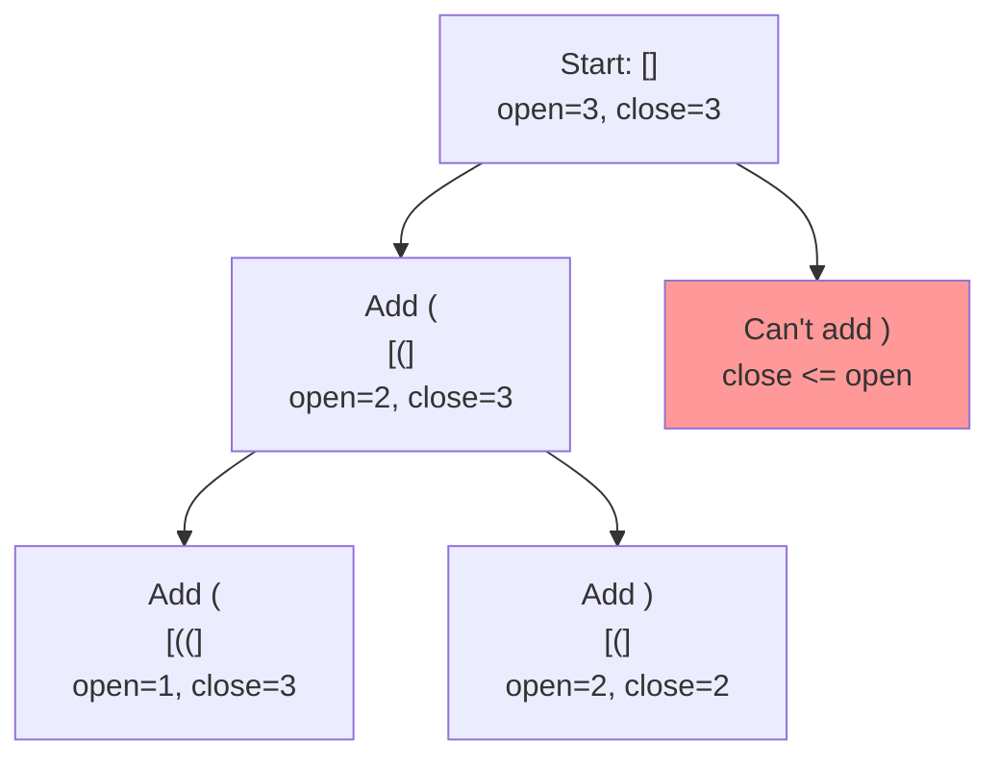
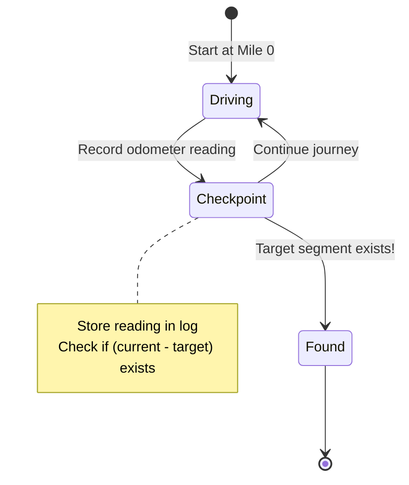
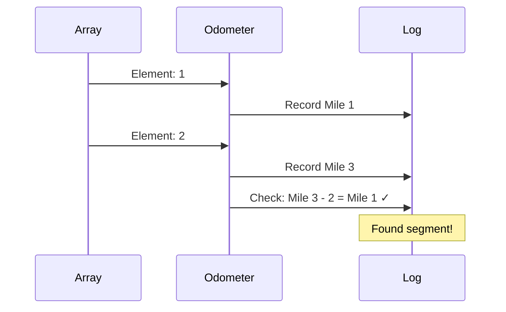

# Mental Model Building for LeetCode Problems

## Purpose
This skill creates mental model study guides that help understand algorithm concepts through **a single, powerful analogy**.

**What this skill does:**
- Builds deep understanding of the problem and solution approach
- Explains the "why" behind algorithmic choices
- Creates memorable mental models using real-world analogies

**What this skill does NOT do:**
- Analyze or debug existing code
- Fix bugs in implementations
- Review or critique current solutions
- Compare multiple solution approaches

## Study Guides Location
- Always create study guide directories in `/Users/snesjhon/Developer/snesjhon/ysk/study-guides/`
- Never create directories in the leetcode folder itself
- Use the format: `/Users/snesjhon/Developer/snesjhon/ysk/study-guides/[problem-number]-[problem-name]/`

## Required Workflow
1. Choose ONE powerful analogy and commit to it
2. Build the case for why this analogy fits perfectly
3. Create mental-model.md using only that analogy throughout
4. Use mermaid charts for visualizations
5. **MUST validate all mermaid charts** using the validation script
6. Fix any validation errors before considering the file complete

**Validation command:**
```bash
~/Developer/dotfiles/claude/skills/leet-mental/validate-mermaid.sh mental-model.md
```

---

## Core Principles

1. **Choose ONE analogy and commit** - Select a single real-world metaphor and use it consistently
2. **Defend your analogy choice** - Explain why this specific analogy maps perfectly to the problem
3. **Stay in the analogy** - Never break character; keep all explanations using analogy terms
4. **Build from ground up** - Start with the simplest case, show the pattern emerging
5. **Focus on intuition, not math** - Avoid formulas and equations until after understanding
6. **Use clear visualizations** - Leverage mermaid charts and tables
7. **Explain every piece** - Never assume understanding of any component
8. **⭐ BUILD CODE INCREMENTALLY** - Each analogy concept must map to a code snippet. Build the algorithm piece by piece as you explain the analogy, not all at once at the end

## Why Defend the Analogy?

**A strong mental model requires justification.**

Don't just pick an analogy - prove it's the right one. Address:
- **Perfect mapping:** Show how every algorithm concept has a natural real-world parallel
- **Edge case clarity:** Demonstrate that weird edge cases make sense in your analogy
- **Natural constraints:** Show that algorithm rules/limitations mirror real-world physics
- **Aha moment:** Explain what insight becomes obvious through this lens

**Example defense:**
> "The odometer analogy works perfectly for subarray sums because:
> - Running sum = total miles driven (only goes forward)
> - Subarray = segment between two checkpoints
> - Negative numbers = going backward (odometer decreases)
> - Finding target sum = finding exact distance traveled between checkpoints
> - Why use a hashmap? Because you keep a logbook of every checkpoint!"

The defense makes the choice feel inevitable, not arbitrary.

## Building Code Through the Analogy

**CRITICAL: The analogy should progressively build the code, not exist separately from it.**

### Why This Matters

Analogies are powerful, but without tying them to actual code constructs, they remain abstract. The goal is to show:
1. **Analogy concept** → **Specific code logic**
2. **Incrementally build** the algorithm as you explain
3. **Each section adds code** that corresponds to the analogy being explained

### The Wrong Way

❌ **Separate analogy from code:**
```
## The Analogy
[Long analogy explanation]

## Complete Solution
[Dump entire algorithm here]
```

This forces the reader to make the connection themselves. Many won't.

### The Right Way

✅ **Interleave analogy with code building:**

```markdown
## Setting Up the Quality Control Station

In our factory, we need two things:
- **Storage position**: Where we'll place the next good item
- **Inspector**: Who walks the line checking items

**In code, this means:**
```typescript
let storageSlot = 0;  // Next position for good items
// Inspector = our loop variable (shown next)
```

## The Inspector Walks the Line

The inspector examines each item on the belt, one by one, from start to finish.

**In code:**
```typescript
let storageSlot = 0;

for (let inspector = 0; inspector < nums.length; inspector++) {
    // Inspector is now at position 'inspector'
    // What should they do? (explained next...)
}
```

## Checking Each Item

When the inspector finds a good item (not defective), they place it at the storage position and advance the counter.

**In code:**
```typescript
let storageSlot = 0;

for (let inspector = 0; inspector < nums.length; inspector++) {
    const currentItem = nums[inspector];

    if (currentItem !== val) {  // Good item!
        nums[storageSlot] = currentItem;  // Place it
        storageSlot++;                     // Advance storage
    }
    // If defective, skip (do nothing)
}
```

## Reporting Results

After inspecting every item, the storage counter tells us how many good items we have.

**Final code:**
```typescript
function removeElement(nums: number[], val: number): number {
    let storageSlot = 0;

    for (let inspector = 0; inspector < nums.length; inspector++) {
        if (nums[inspector] !== val) {
            nums[storageSlot] = nums[inspector];
            storageSlot++;
        }
    }

    return storageSlot;  // Count of good items
}
```
```

### The Pattern

Each section should follow this pattern:
1. **Analogy concept** - "The inspector walks the line"
2. **Why it matters** - "We need to check every item once"
3. **Code mapping** - Show the code that implements this concept
4. **Progressive building** - Add to previous code, don't start from scratch

By the end, the reader has seen the algorithm built piece by piece, with each piece justified by the analogy.

### Structure Template

```markdown
# [Problem Name] - Mental Model

## The [Single Analogy Name] Analogy

[Opening statement: "Understanding this problem is like..."]

### Why This Analogy Works

**The core insight:** [One sentence explaining the key parallel]

**Perfect mappings:**
- Algorithm concept A → Real-world element X
- Algorithm concept B → Real-world element Y
- Algorithm operation C → Real-world action Z

**Why this analogy and not others:**
[Defend why this specific analogy is superior to alternatives]
- Rules/constraints map naturally
- Edge cases make intuitive sense
- The "aha moment" becomes obvious

## Building the Algorithm Step-by-Step

### Step 1: [First Analogy Concept]

**The analogy:**
[Explain the concept in analogy terms]

**What this means in code:**
```typescript
// Show just this piece
let variable = initialValue;
```

**Why:** [Connect the code to the analogy]

### Step 2: [Second Analogy Concept]

**The analogy:**
[Next concept - builds on previous]

**Adding to our code:**
```typescript
let variable = initialValue;

for (let i = 0; i < input.length; i++) {
    // This loop represents [analogy concept]
}
```

**Why:** [Explain the connection]

### Step 3: [Third Analogy Concept]

**The analogy:**
[What happens inside the main operation]

**The logic:**
```typescript
let variable = initialValue;

for (let i = 0; i < input.length; i++) {
    if (condition) {  // In our analogy: [what this check means]
        // Take action
    }
}
```

**Why:** [Connect to analogy]

### Step 4: [Final Piece]

**The analogy:**
[How we know we're done, what to return]

**Complete algorithm:**
```typescript
function solveProblem(input: number[]): number {
    let variable = initialValue;

    for (let i = 0; i < input.length; i++) {
        if (condition) {
            // Action
        }
    }

    return variable;  // In analogy: [what this represents]
}
```

## Tracing Through an Example

[Use a concrete example, show:
1. Analogy state at each step
2. Corresponding code state
3. How they mirror each other]

## Common Misconceptions

### ❌ "[Wrong assumption]"
Why it's wrong: [Counterexample in analogy AND code]

### ✅ "[Correct understanding]"
Why it's right: [Concrete example showing analogy and code alignment]

## Try It Yourself

[Exercise with:
1. Input in analogy terms
2. Expected analogy steps
3. What the code does
4. Expected output]
```

### Visualization Guidelines

**USE MERMAID CHARTS FOR:**
- Tree/graph structures (binary trees, graphs, decision trees)
- Flow diagrams showing algorithm progression
- State transitions and recursion paths
- Sequence of operations over time

**USE TABLES FOR:**
- State changes across steps with multiple variables
- Comparison of values at different stages
- Lookup tables and mappings

**Mermaid Chart Best Practices:**
- Always validate chart syntax before considering them complete
- Label nodes with concrete values from your example (not abstract variables)
- Use analogy-based labels (e.g., "Mile 70" instead of "sum=70")
- Keep hierarchy clear with proper indentation
- Include legend or key when needed

**DON'T:**
- Don't use abstract variable names in diagrams
- Don't skip showing intermediate states
- Don't create charts without validating them first

### Mermaid Chart Examples by Problem Type

**Binary Tree Problems:**


**Backtracking/Decision Trees:**


**State Machine/Flow:**


**Sequence/Timeline:**


### Validating Mermaid Charts

**CRITICAL: Always validate charts before completion**

After creating a mental model with mermaid charts, you MUST validate them:

```bash
# Run the validation script on your mental-model.md file
~/Developer/dotfiles/claude/skills/leet-mental/validate-mermaid.sh mental-model.md
```

The script will:
1. Extract all mermaid blocks from the markdown file
2. Validate basic syntax (diagram type, structure, common errors)
3. Report which charts pass syntax validation
4. Exit with error code if any chart has syntax errors

**Validation workflow:**
1. Create mental-model.md with mermaid charts
2. Run validation script
3. If errors found: fix the mermaid syntax and re-run
4. Only consider the file complete when all charts pass validation

**Note:** This performs basic syntax validation without rendering. Charts should still be visually verified in GitHub, Obsidian, or other markdown viewers.

### Example: Good vs Bad Explanations

**❌ BAD:**
```
We check if (current_sum - k) exists in the hashmap.
If it does, we found a subarray.
```

**✅ GOOD:**
```
Imagine your car's odometer shows 100 miles.
If you want to find when you drove exactly 30 miles,
you look in your logbook for when the odometer read 70.
The segment between 70 and 100 is exactly 30 miles!
```

### Choosing Your Single Analogy

**CRITICAL: Pick ONE analogy and commit to it completely.**

Don't mix analogies. Don't switch metaphors mid-explanation. The power comes from consistency.

#### Proven Analogies by Problem Type

**Subarray Sum Problems:**
- **Odometer journey** (running sums = cumulative distances traveled)
  - Why it works: Segments between checkpoints = subarrays
  - Natural fit for prefix sums, looking back at previous readings
- Alternative: Bank account balance (but less visual)

**Tree Problems:**
- **Mountain climbing** (going up to children, down to parent)
  - Why it works: Height/altitude maps to depth, peaks = leaves
  - Natural fit for DFS, path concepts
- Alternatives: Family tree, org chart (but less dynamic)

**Backtracking:**
- **Maze exploration** (try paths, hit walls, backtrack)
  - Why it works: Dead ends = invalid states, retracing steps = backtracking
  - Natural fit for constraint checking, state restoration
- Alternative: Building with rules (but less about exploration)

**Graph Problems:**
- **City/road map** (cities = nodes, roads = edges)
  - Why it works: Distance, connectivity, paths all intuitive
  - Natural fit for BFS/DFS, shortest path
- Alternative: Social network (but less spatial)

**Selection criteria:**
- Does every algorithm concept have a natural real-world parallel?
- Do edge cases make sense in the analogy?
- Will someone remember this analogy weeks later?
- Can you explain the entire solution without leaving the analogy?

### Variable Naming in Solutions

When implementing with the analogy:
- Use analogy-based names: `odoLog`, `milesDriven`, `segmentsFound`
- Avoid generic names: `map`, `sum`, `count`
- Make the connection to mental model obvious

**Example:**
```typescript
// ✅ GOOD - Uses analogy
const odoLog = new Map();
let milesDriven = 0;
const targetReading = milesDriven - k;

// ❌ BAD - Generic
const map = new Map();
let sum = 0;
const target = sum - k;
```

### Testing Your Mental Model

Before considering a mental model complete, verify:

1. **Single analogy test:** Did you stay in ONE analogy throughout?
2. **Code built incrementally:** Does each section add code that maps to the analogy concept being explained?
3. **Clear mapping:** Can you point to which analogy concept corresponds to which line of code?
4. **Progressive understanding:** By reading sequentially, does the algorithm build naturally without jumps?
5. **Can you explain it without code?** Walk through entirely using analogy terms
6. **Does it answer "why"?** Not just "what" or "how"
7. **Can you predict behavior?** Given new inputs, trace outcome in analogy terms
8. **Does it handle edge cases?** Explain why base cases exist using the analogy
9. **Is it memorable?** Will you remember the analogy days/weeks later?
10. **No code analysis?** Did you avoid debugging or reviewing existing code?
11. **Analogy justification:** Did you defend WHY this analogy is the right choice?

**The ultimate test:** Can someone read this once, see how each analogy piece becomes code, and solve similar problems by thinking in terms of your analogy?

### What to Avoid

**Never do these:**
- ❌ Analyzing or debugging existing code implementations
- ❌ Fixing bugs in current solutions
- ❌ Reviewing code quality or suggesting refactors
- ❌ Mixing multiple analogies or switching metaphors mid-explanation
- ❌ Starting with "The algorithm does X" instead of analogy
- ❌ Breaking out of the analogy to use technical terms
- ❌ Using mathematical notation before building intuition
- ❌ Comparing multiple solution approaches (focus on understanding ONE way)
- ❌ Assuming knowledge of data structures (explain why through analogy)
- ❌ Skipping the "why this exists" for each component
- ❌ Using confusing phrasing like "subtract an old running total"
- ❌ Missing the progression from simple to complex examples
- ❌ Generic variable names (use analogy-based names always)
- ❌ **Dumping complete code at the end instead of building it incrementally**
- ❌ **Explaining analogy separately from code - they must be interleaved**

**Remember:** This is about building understanding, not analyzing code.

### Reference Examples

**Excellent mental models:**
- `/Users/snesjhon/Developer/snesjhon/ysk/study-guides/022-generate-parentheses/mental-model.md`
  - Uses mountain climbing analogy
  - Builds from n=1 to n=3
  - Explains constraints naturally

- `/Users/snesjhon/Developer/snesjhon/ysk/study-guides/560-subarray-sum-equals-k/mental-model.md`
  - Uses odometer/checkpoint analogy
  - Shows why hashmap stores counts
  - Traces duplicate readings clearly
